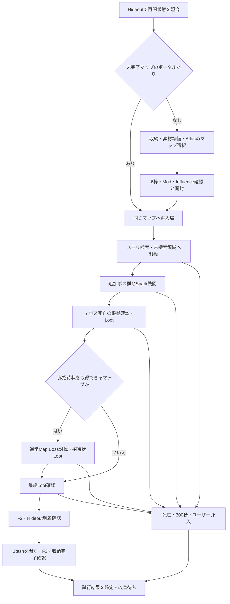

# Awakening Boss Rush — 独立ファームモード設計

設計日: 2026-09-16。設計タスクの実行設定: `gpt-6-astra / xhigh`（このタスクの実行記録で確認済み）。

この文書は実装・実機検証への引き継ぎ用。今回の段階ではAutoExileの動作コード・設定を変更せず、マップ開封・起動・Reloadは実行しない。次のユーザー入力を受けて実装と改善ループに進む。

## 1. 目的と対象

独立した `Awakening Boss Rush` モードを追加する。Atlas内のT16 Duneマップ1枚と、Sacrifice at Dawn / Noon / Dusk / Midnightを各1個、Horned Scarab of Awakeningを1個使い、追加されたボス群を探してSpark of the Novaで倒し、指定Lootを回収して帰還する。ユーザー指定のDuneはゲームデータの正式名／Area IDに解決し、Dunes等の表記差を確認して保持する。

ユーザー回答で確定: 赤招待状はSearing ExarchのIncandescent Invitation、追加Lootは地面1スタック合計5c以上、F2はQuickPortal、F3はStashieV2。NG Modは下記17項目。未指定なのは素材Stashタブで、実装時に探索する。

主目的は**補充・移動・戦闘・Loot・収納・死亡・再挑戦を含む実運用の純利益/時**の最大化。記事の時給を達成条件にはしない。相場とビルドが違うため、実際の消費原価と回収品から評価する。

参考記事では、覚醒スカラベの対象は6種類の招待状に由来する3〜5体のボス群と説明されている。「ピナクルボス」という名前だけでフィルタするとガーディアン等を取りこぼすため、この設計では対象を `AwakeningEncounter` と呼ぶ。出現数・構成・Metadataは現在のクライアントで確認し、固定の「3体倒したら完了」にはしない。

参考:

- [指定されたファーム記事](https://note.com/mrdagonn/n/na14e80e93851)
- [poe.ninja Allflame Currency](https://poe.ninja/poe1/economy/allflame/currency)

## 2. ローカル調査で確認できたこと

| 対象 | 確認結果と設計への反映 |
|---|---|
| `Modes/WaveFarm/WaveFarmMode.cs` | `IBotMode` として独立登録可能。現在のHideout経路は素材・マップを20周分補充するため、そのまま利用しない。今回のマップ供給元はAtlas内に限定する。 |
| `Systems/MapDeviceSystem.cs` | Atlas内のマップ一覧、6枠のDevice、Activate、ポータル確認がある。ただし素材不足・Inventory読み取り失敗でもActivateへ進む経路がある。厳密なレシピ確認を追加する。 |
| `Systems/StashSystem.cs` | タブ移動・素材取得を再利用できる。一括取得はスタック全体を移し、複数素材モードでは欠品を飛ばすため、必要数・取得結果の追加確認が要る。 |
| `Systems/EntityCache.cs` | EntityAdded/Removed、種類別索引、再入場時の再構築がある。Pruneは死亡個体をMonsters一覧から除去する。討伐観測はPruneより前の観測／イベント経路で保存する。 |
| `BotCore.cs` のMinimap scanner | `IngameState.Data.TileEntities` と `MinimapIcon` を利用。現在2秒間隔。情報は到達範囲・鮮度に限界があり、マップ全域のボス位置が常に読めるわけではない。 |
| `Modes/SimulacrumMode.cs` | 定点Spark、HP+ESの減少を使う進捗監視、Intensity、低ES時の攻撃継続、無進捗時の移動、入力停止の実装がある。 |
| `Systems/SparkProgressTracker.cs` | 生存個体へのダメージも進捗に数え、単なるEntity消失をキル扱いしない。ボス専用の観測集合で再利用する。 |
| `Systems/LootSystem.cs` | 主な候補はVisibleGroundItemLabelsから作る。価格不明品を最終的に拾う既存経路があるため、今回のLoot方針を明示的に差し込む。 |
| `Systems/NinjaPriceService.cs` | Allflameを自動検出、価格キャッシュ・定期更新・スタック合計価格を実装済み。2026-09-16のVerboseで33/33カテゴリ、11,779件読込を確認。Currency APIへの読取でも100行とMaven Chisel 5種を確認。 |
| 現在のExileCore.dll | `ServerData.SearingExarchCounter`、`EaterOfWorldsCounter`、`AtlasPanel.SearingExarchCounterElement` が存在する。数値の意味・更新タイミングは未検証。 |
| Reload | `PluginManager.ReloadSourcePlugin` / `ReloadPluginDll` / `ReloadChangedDll` が存在する。呼び出し方、実行スレッド、完了検出は実装前に確認する。 |
| `AutoExile.csproj` | net10.0-windows。通常build後に `Plugins/Temp/AutoExile` へコピーするが、コピー失敗はContinueOnError。build成功だけでは読込成功を証明できない。 |
| `BotCore.LogLoadedAssemblyDiagnostics` | 現在もDLLのパス・SHA256を記録する。ディスク上ファイルだけでなく、ロード済みAssemblyのMVIDとBuildIdも返すよう強化する。 |
| QuickPortal / StashieV2 | 保存設定はF2 / F3、有効化済み。StashieのIgnoredCellsは右端1列。F3は実行中に再押下すると収納を停止する。 |
| ログ | `Logs/Verbose20260916.log` に既存のAutoExileのLogMessageが出力されている。Verbose専用ファイルへの別プロセスからの直接追記は不要。 |
| 設定 | 現在のWave FarmはStacked Deck、マップ名「有毒な下水道」、Witness=None、MappingSuppliesTabName空欄。これを新モードの確定設定として流用しない。 |
| 統計 | 現在のChaosPerHourは回収価値/稼働時間。純利益の計算には素材原価と再挑戦を考慮した拡張が必要。 |

## 3. 構成

独立した `AwakeningBossRushMode : IBotMode` と専用設定を追加する。WaveTick全体の流用はしない。通常の全域クリア、Ritual等の寄り道、カバレッジによる完了条件は今回の目的に合わないためである。

| 新設／変更候補 | 責務 |
|---|---|
| `Modes/AwakeningBossRush/AwakeningBossRushMode.cs` | 状態遷移、終了条件、既存システムの呼出し、HUD |
| `AwakeningRunState.cs` / `AwakeningRunStore.cs` | マップと試行の識別、再入場、Reloadを越えるチェックポイント |
| `AwakeningBossTracker.cs` / `AwakeningBossCatalog.cs` | 対象群・通常Map Bossの区別、各個体の生存／死亡／不明状態 |
| `AwakeningScout.cs` | メモリ上の候補→経路→未知領域探索、探索記録 |
| `AwakeningLootPolicy.cs` | 必須Loot、5c判定、価格不明・拾得失敗・最終回収確認 |
| `EldritchInvitationTracker.cs` | Exarch進捗、今回の通常Map Boss討伐要否 |
| `AwakeningMapPolicy.cs` / `AwakeningModRiskAnalyzer.cs` | 指定NG Modの事前拒否、未指定Modの実績集計と追加NG候補の検出 |
| `AwakeningTelemetry.cs` | 共通イベント、戦闘リングバッファ、マップ終了要約 |
| `Modes/Shared/SparkCombatController.cs` | Simulacrumの定点Spark動作を移植し、ボス用進捗と移動方針を注入可能にする |
| `Modes/Shared/ExternalPluginFlow.cs` | F2/F3の入力引き渡しと実結果の確認 |
| `Systems/MapDeviceSystem.cs` | 明示的なレシピ・必須素材検査・Atlasからの選択・開封の一意性 |
| `BotCore.cs` / `BotSettings.cs` / Web UI | モード登録、状態公開、停止・死亡通知、入力所有者の制御、Reload診断 |
| `Statistics/*` | 原価、マップと試行、時間内訳、純利益、Reloadを越えた重複防止 |
| `Tests/AwakeningRegression/*` | メモリ観測と状態遷移の再生テスト。ゲーム入力は送らない |

最初から大規模な共通化はしない。Sparkの既存動作を再現できる単位で移植し、Simulacrum側の変更が必要な場合はその既存回帰検証を通す。Build設定・スキルキーは現在成功している設定を読み、W等を決め打ちしない。

## 4. 状態遷移と二段階の実行管理

モード内のゲーム操作と、Codexによる「ログ確認→修正→build→Reload→次の試行」を分離する。開発中は `SupervisedIteration=true` にして、1試行の終端を保持し、Codexが結果を読む前に次のマップを消費しない。最終的な周回モードは、同じ状態機械からHideout処理後に次周へ進める。

`RunId` は消費したマップ単位、`AttemptId` は入場・再入場単位。試行結果は次を区別する。

- `Success`: 追加ボス群の全滅、必須・対象Loot回収、必要な通常Map Boss処理が完了し、Hideoutへ到着した。
- `Death`: 死亡を検出。死亡した時点の証拠を保持し、復帰先とHideout到着を別イベントで記録する。
- `Timeout`: 入場後の操作可能時点から300秒経過してもマップ内。状態を確定して診断を保存し、可能ならF2で帰還する。帰還できても成功に上書きしない。
- `ManualIntervention`: ユーザーによる停止。入力を止めて状態を保持し、改善前に勝手に再スタートしない。
- `OperationalFailure`: 素材不足、収納停止、ポータル期限切れ、価格取得不可など。戦闘失敗や成功には混ぜない。

死亡・タイムアウト・停止の監視は、モードTickの入力待ち／フォーカス待ちより手前に置く。BotCoreの早期returnによって監視が止まらないようにする。300秒は単調時計を使い、Reload時の経過時間をチェックポイントから復元する。再入場は新Attempt、同一Runの総時間と死亡数は継続する。

「停止して修正させるための介入」は今回依頼された失敗→改善→再挑戦の対象。「今日は終わり」「作業を止めて」等の追加指示が来た場合は、Codexの改善ループ自体を停止する。

停止理由は `UserHotkey / UserDashboard / CodexEvaluation / Death / Timeout / RuntimeLimit / ModeChange` 等で保持する。CodexがReload前に発行した停止をユーザー介入として再分類しない。制御コマンドはrequestIdと対象generationを持たせ、受理応答と実行完了を区別する。

## 5. マップと素材の準備

`MapRecipe` は、Map×1、4種類のSacrifice各1、Awakening×1の**種類別必要数**を持つ。現在のScarabDatabaseにはAwakeningの登録がないため、ゲームのBaseItemTypes等でMetadataを照合して追加する。英語名・日本語表示・曖昧なPath部分一致を混同しない。

1. 前周の収納を終え、右端列以外が空であることを有効なInventoryスナップショットで確認する。
2. 指定タブ、またはStashIndexerで見つけたタブから素材を補充。ScarabsとFragmentsが別タブでも扱う。タブ名が空なら、候補を実読取で確定して設定に保持する。
3. 初期実装は1周分を扱う。既存のCtrl+クリックは全スタックを移すため、必要なら分割取得を使う。余分なスタックを取得した場合は数量を記録し、次のF3で収納されることを許容する。新モードの収納完了条件を守るため、右端以外に周回素材を保存し続ける方式にはしない。
4. AtlasのInventoryから指定条件のMapを選択する。Player Inventoryへの代替探索や20枚のマップ引き出しは無効化する。マップ名だけでなくTier・識別済み状態・Modを確認する。
5. T16 Duneを必須条件にする。8 Modの準備済みMapを記事に沿う優先候補とし、8 Modであることをユーザー未指定の必須条件にはしない。下記NG Modを含むMapは開封しない。マップを自動でロールしたり購入したりはしない。
6. Deviceに挿入後、**Mapを含む6枠すべての実アイテム**を読んでレシピと一致することを確認する。「5枠埋まった」だけでは合格にしない。毎回、足りない種類を1つずつ入れ、在庫先頭の同じ種類を繰り返し入れない。
7. Exarch Influence、必要なAtlas preset、選択したMapを読んで確認する。既存のWitnessType設定はMapDevice処理で実行されていないため、UI制御と結果確認を追加する。
8. `activation.requested` を永続化してからActivateを1度送る。素材消費、Deviceの変化、新しいポータルを照合して `activation.confirmed` を確定する。通信待ち・Reload後に同じ開封要求を再送しない。

UI読み取りnullは「空」「素材切れ」ではなく `Unknown`。有効な複数フレームで判定し、枠構造が現在のExileAPIに合わない場合は診断を保存して開封しない。一般モードの既存挙動を不用意に変えず、厳密なレシピ指定時にこの制御を使う。

### 5.1. 指定NG Mod

以下の17項目をユーザー指定の拒否条件として保存する。表現が有利な効果に見えるものも、こちらの判断で除外リストから外さない。`implicit`はModの種別指定として扱う。

| # | ユーザー指定の表記 |
|---|---|
| 1 | Players cannot Regenerate Life, Mana or Energy Shield |
| 2 | Players have #% less Recovery Rate of Life and Energy Shield |
| 3 | Players have #% less Armour |
| 4 | Rare Monsters have Physical Thorns reflecting # Physical Damage |
| 5 | Rare Monsters have Elemental Thorns reflecting # Elemental Damage |
| 6 | Rare monsters in area are Shaper-Touched |
| 7 | Players have #% less Area of Effect |
| 8 | Players have #% to all maximum Resistances |
| 9 | Players have #% more Defences |
| 10 | implicit: Area is influenced by The Shaper |
| 11 | implicit: Map is occupied by The Eradicator |
| 12 | implicit: Map is occupied by The Purifier |
| 13 | implicit: Map is occupied by The Constrictor |
| 14 | implicit: Map is occupied by The Enslaver |
| 15 | Monsters cannot be Leeched from |
| 16 | Players have #% more Cooldown Recovery Rate |
| 17 | Players gain #% reduced Flask Charges |

判定は表示テキストの単純な部分一致にしない。現行クライアントのStat ID、Mod ID/Group、数値、明示／暗黙Mod、影響・占有情報を取得し、上記の各ルールに対応付ける。日本語表示、数字、符号、複数効果を持つMod、Atlasによる効果量変化を扱う。現行のMapModCheckerの既知グループだけでは17項目を網羅できないため、新ルールの照合を追加する。

`more Defences`、`more Cooldown Recovery Rate`、最大耐性の符号が省略された表記は、入力文を保持して実際のStatと数値をログに出す。対応が不確かなものを勝手に正反対の条件へ翻訳しない。開封前の校正で各ルールを `Resolved / Unresolved` として公開し、未対応の拒否ルールが残る間は自動開封を開始しない。ゲームデータでも意味が特定できない場合に限り、実際の候補Statと数値を示してユーザーに確認する。

選択候補ごとに `map.accepted / map.rejected / map.unreadable` と適用ルールID、読み取った生データを記録する。拒否したMapの識別子を保持して同じMapを毎回選ばない。NG Mapは廃棄・再ロールしない。

## 6. ボス探索と「全て倒した」の判定

探索順は、(1)読み込まれた対象Entity、(2)TileEntities/MinimapIconの候補、(3)記録済みの最終位置、(4)地形に基づく未探索領域。メモリは観測できた範囲で利用し、見えない対象を存在しないと決めつけない。

`BossObservation` にInstance、EntityId、Metadata、所属群、位置、取得元、観測時刻、読取の有効性、IsAlive、HP/ES、Targetable、無敵・段階遷移の根拠を保存する。マップ境界・領域切替を越えてEntityIdだけをキーにしない。

- 現在のMetadataと所属情報を優先して対象を識別する。Unique rarityだけでは通常Map Boss、召喚体、NPC等を区別できない。
- ミニマップ上の一般的なUniqueアイコンは探索候補。近づいてEntityを読み、初めて追加ボスと確定する。
- ボス群は戦闘前から構成を記録する。途中で増えたメンバー・別フェーズ・分身を同じ個体の死亡と取り違えない。
- 個体状態は `Candidate / Alive / Dormant / Phased / Missing / DeadConfirmed`。消失、範囲外、読取失敗、無敵、非Targetableは死亡ではない。
- `DeadConfirmed` は有効な死亡状態、または検証済みの遭遇終了情報を根拠とする。即死してHP遷移を取り逃した場合も、死亡Entity／遭遇状態の別証拠を探す。
- 成功には、遭遇が発見され、構成の確定根拠があり、全メンバーが死亡確認済みであることが必要。期待構成が確定できない、Missing個体が残る場合は完了を断定しない。
- 討伐後はボス群周辺を再観測し、新しいボス・遅延ドロップ・フェーズ移行を確認する短い安定待ちを入れる。静穏時間だけでは未知のメンバーの死亡を代用しない。

初期の実機観測で6系統のMetadataと構成ルールを作る。未分類ボスは詳細を保存し、Uniqueを全部倒して完了とする代替処理には進まない。未知群でも周辺Uniqueを戦闘候補にできるが、結果は `UnverifiedEncounter` として改善対象にする。

探索ではNavigationSystem / ExplorationMap / Pathfindingを再利用する。到達可能な未知領域と有力候補を優先し、一般敵やメカニクスの全処理を目的にしない。道を塞ぐ敵や生存上必要な敵は攻撃する。経路再要求で完成した経路を上書きする問題を再発させない。

各経路の距離、候補到着、再探索、失敗、戻り歩き、停止時間を計測する。ミニマップ再読取は探索中250〜500msを初期候補とし、フル走査負荷を測って調整する。地形全体を取得できても、そこから未知のボス位置を断定しない。

## 7. Spark of the Novaによる戦闘

Simulacrumで良好な動作をしているBuild設定と入力制御を出発点にする。ここでいう定点Sparkは、ゲーム上のチャネリングスキルであるという意味ではなく、既存実装のキー保持による継続詠唱を指す。

- ボス群へ届く地点に到着したら移動を止めて継続詠唱する。入力はCombat / Navigation / Lootのうち1つだけが所有する。
- **対象ボス別のHP+ES減少**を進捗にする。雑魚のキルや召喚体へのダメージだけで「ボスに火力が出ている」と評価しない。
- 有効なボスダメージが継続している間は、単なる時間上限や雑魚キル減少で位置を変えない。Intensityを落としてDPSを下げる移動を削減する。
- 約200msごとに有効な観測を追加する。3秒程度の無進捗を初期の再配置候補とし、Targetable・無敵・距離・通路・攻撃中かを調べてから判断する。閾値は設定化する。
- 低ESでも攻撃で回復できている場合は、SimulacrumのEmergency Spark方針を利用する。生命低下速度や既知の危険動作が大きい場合は回避を優先する。
- 再配置では詠唱を解除し、到達可能な短い移動先へ移動して即座に詠唱を再開する。位置が変わらない場合は「移動成功」とせず、防御攻撃を再開しつつ経路を改善する。
- 危険な戦闘中のLootは後回しにする。攻撃・回復を切るLoot割り込み、対象不在でのキー保持、移動中の詠唱競合を診断する。

死亡時は観測可能な事実と原因候補を分ける。PoEのクライアント観測だけで最後の一撃の攻撃者・ダメージ内訳を確実に取得できるとは限らないため、「ボスXが死因」と断定するログを作らない。

## 8. Lootと赤招待状

必須Lootは明示リストとして、Maven's Chisel 5種、Chisel指定に含むCartographer's Chisel、Crescent Splinter / Maven's Writ等のMaven関連フラグメント、対象のMaven Invitation、取得対象の赤招待状を扱う。実機のMetadataで対応付け、これらは5c未満でも拾う。落ちない品を待ち続けるのではなく、実際に観測された品を回収する。

追加Lootはpoe.ninja Allflameで価値が確認できる品を対象にする。確定条件は **地面1スタックの合計が5c以上**。通り道・観測済み地点の対象品は回収し、未知の高額品を探すための全域クリアは行わない。拾う順序を回収時間で最適化しても、ユーザー指定の価格閾値を勝手に上げない。

- 既存サービスはスタック価格を返すため、数量を二重に掛けない。APIの基準通貨がchaosであることを確認し、必要なら通貨変換する。
- CurrencyだけでなくFragment / Scarab / Invitation等の既存カテゴリも利用する。リーグ、カテゴリ、取得時刻、単価、数量、合計、照合根拠を記録する。
- 読取が未完成の品と、相場が存在しない品を分ける。短い再評価後、価格不明の非必須品は原則スキップして記録する。
- 未鑑定Uniqueの最高候補価格やRare装備のベース価格を、その品の確定価値として利用しない。価格確定ができない装備には別の明示ルールが必要。
- 初期価格取得はHideoutで待つ。期限内の正常キャッシュを利用できる場合は継続する。価格も有効キャッシュもなければ新規開封を待ち、進行中マップでは必須Lootを回収し、価格未判定品を記録して再評価する。
- キャッシュはリーグ・カテゴリ単位で鮮度を管理し、一部カテゴリの更新成功を全カテゴリの価格更新として扱わない。
- `EntityCache.WorldItems` と表示ラベルを照合する。フィルタで非表示の必須品や高額品が観測できたら、ラベル表示操作と再走査を試す。表示できない品を「拾うものなし」にしない。
- クリック後はInventory内の同種品の数量増加を確認し、地面側の変化と組み合わせて拾得を記録する。表示ラベルの消失だけで利益に加算しない。
- 失敗した対象には再試行上限・再接近を持たせる。回収未完了、Inventory満杯、ラベル非表示は明示的な未完了結果にする。満杯ならF2/F3で一時収納し、ポータルがあれば同じRunで残品を回収する。

赤招待状は、確定した対象であるExarchのIncandescent Invitationを扱う。`SearingExarchCounter` とAtlas表示を開封前／入場後／最初のInfluence進行後／退出前に記録し、**このマップで通常Map Bossを倒せば入手できる**状態を判定する。

`NeedMapBoss = Yes / No / Unknown` とし、読み取り失敗をNoにしない。カウンターがいつ進むか、Atlas効果で進捗が増えるか、対象Tier・Influenceが有効かを実測で照合する。「27なら必ず倒す」等の固定判定を未検証で採用しない。Unknownなら再読取・Atlas表示照合を行い、解決できなければ判断保留として報告する。

Yesのマップだけ通常Map Bossへ意図的に向かう。複数ボス・別部屋・フェーズのあるMapにも対応し、通常ボスの討伐判定と招待状の地面出現／拾得を別々に記録する。移動中のSparkで偶然倒した場合も観測して記録する。

## 9. F2帰還・F3収納・死亡復帰

外部プラグインへ渡す前に、AutoExileが発行した入力の完了／取消を確認し、移動・詠唱・クリックを解除する。`ExternalPluginFlow` 中はAutoExileのNavigation、Combat、Stash、Gem Level Up、UI自動閉じ等から入力を送らない。外部プラグインはAutoExileの内部入力ロックを共有しないので、内部CanActだけでは排他にならない。

- F2を1度押して、Loading→Area変化→Hideout判定→Player有効を待つ。キー送信成功は帰還成功ではない。再試行はQuickPortalの処理状態・タイムアウトを確認してから限定的に行う。
- HideoutでStashへ近づき、Stashが実際に開いたことを確認してからF3を1度送る。
- 有効なPlayer Inventoryで、右端列以外を占有するアイテムがゼロの状態が複数観測続くことを確認する。nullを空としない。2マス以上の品は左上座標だけでなく占有範囲で判定する。
- StashieのCoroutine終了を読める場合は併用する。ゼロになった直後もタブ移動・修飾キー入力が続く可能性があるため、外部処理の終了または安定待ち後に所有権を戻す。
- F3を再押下すると停止になるため、収納が遅いという理由で連打しない。残品、停滞時間、タブ、Stashie状態を記録して原因を調べる。
- 現在のBotCoreは死亡後にResurrectAtCheckpointを選ぶ。新モードでは復帰先を観測し、マップ内へ復帰した場合は診断確定後にF2で帰還する。利用可能な復活ボタンと動作は初回検証で確定する。

F2/F3が使えない場合はOperationalFailureにする。帰還・収納の完了を推測して新規マップを開かない。

## 10. Reloadと同一マップ再挑戦

実装段階の最初に、ゲームを操作せずに実行中ホスト・読込DLL・HTTPエンドポイント・設定の保存先を照合する。その後、次のReload手順を用意する。

1. 当該Attemptの終端を記録し、入力を解除する。復旧可能な場合はHideoutへ戻り、設定とチェックポイントを保存する。
2. 修正に対応した回帰チェックを実行し、明示した構成でbuildする。Tempへのコピー結果と対象DLLを確認する。
3. 既存ホストのReload機能を利用する。初回に公開可否・メソッド引数・実行スレッドを調べ、必要ならlocalhostの制御コマンドからホスト処理へキューを渡す。自己Dispose中のHTTPリクエストに完了応答を期待しない。
4. 新プラグインの起動後に `BuildId`、ロード済みAssemblyのMVID、PluginGeneration、起動時刻、設定schema、復元RunIdをstatus／Verboseで確認する。DLLファイルの更新日時やディスク上SHAだけでは成功扱いにしない。
5. ReloadでHTTPが切れたら期限付きで再接続し、新しいgenerationの応答を確認する。旧世代の遅延コマンド・入力タスクは受け付けない。
6. 入場前に設定と進捗を再照合し、同じRunのポータルが残っていればそこへ入る。対象ポータルが有効に読み取れない状態と、消滅済みの状態を分ける。
7. 入場後のInstanceを確認し、同一マップなら発見済み位置・死亡確認・回収記録を復元する。別Instanceなら古いEntityIdや座標を流用しない。ポータルが確実に無ければ旧Runを理由付きで閉じて新規Mapを開く。

自動Reload経路が使えない場合の代替は、実在するExileAPIのReload UI操作、さらに必要ならExileAPIホストだけの再起動。利用可能な操作手段を実装時に確認する。ゲームを再起動することは同等手順に含めない。Reload可能性はメソッドの存在だけでは実証済みではない。

保存状態は、Run/Attempt、Instance、開封トランザクション、素材消費、ボス観測、最後の探索先、未回収Loot、招待状状態、結果、時計、BuildId、価格snapshotを含む。保存は一時ファイル→置換とschema versionで破損を検出し、設定保存と同様にホストReloadで失わない場所に置く。

## 11. Verboseログと原因分析

出力先は既存ホストの
`C:\Users\iran\OneDrive\ドキュメント\POE\ExileApi-Compiled-master\Logs\VerboseYYYYMMDD.log`。

共通プレフィックスは `[AutoExile][Awakening]`、共通フィールドは `schema / event / utc / elapsedMs / sessionId / runId / attemptId / buildId / generation / area / instance / phase / reason / observationValidity`。イベントは短い人間向け要約と機械で読めるpayloadを持つ。

| 場面 | 最低限記録する内容 |
|---|---|
| 開始・開封前 | 設定snapshot、ビルド・スキル、MapのTier/Mod/IIQ、素材6枠、補充元、在庫前後、価格snapshot、Exarch進捗、時刻 |
| 探索 | 候補の出所と鮮度、対象Metadata、座標、選択理由、経路長、経路待ち、移動入力と実変位、探索coverage、戻り歩き、再経路化 |
| 戦闘 | 各ボスのHP/ES・Targetable・phase、プレイヤーHP/ES/回復/主要buff/debuff/Intensity、詠唱状態、Flask、移動判断、危険動作・地面効果の観測 |
| Loot | 名前/Metadata/ID/数量/価格/選定理由、可視ラベルとWorldItemの差、クリック、Inventory差分、拾得確定、失敗・スキップ理由 |
| 帰還・収納 | F2/F3発行、外部処理の状態、所有権、LoadingとArea、Stash表示、右端以外の残品数、進捗停止、完了までの時間 |
| 死亡・停滞 | 直前の履歴、最後の移動・詠唱、ボス状態、敵数、バフ、入力所有者、フォーカス、Latency、Tick時間、例外・読取欠損 |
| 終了 | 成功／失敗と根拠、未確認ボス・残Loot、時間内訳、死亡・再入場、消費原価、回収価値、純利益、次の処理 |

戦闘中は200〜250ms単位、直前30秒程度の固定長リングバッファを保持する。常時ファイルへ全Entityを毎Tick書かず、1秒ごとの集約と状態変化、死亡／停滞時のバッファ放出を使う。大きな地形・Entity dumpは読取をフレーム内でsnapshot化し、ファイル出力を別処理へ渡す。ゲームのライブオブジェクトを背景スレッドへ渡して読まない。

ログには観測時刻と書込時刻を区別して持たせる。キュー容量、捨てた件数、書込失敗を可視化し、重要イベントのflushを優先する。ログの負荷でTickが止まるなら計測頻度を調整する。通常の試行要約はVerboseだけで読めるようにし、追加dumpへの参照だけで済ませない。

死因分析の出力は「観測事実」「有力な原因候補」「反証／不足情報」「次に変える1点」にする。例: HP急減と同時にLootクリックでSparkが途切れたことは事実として書けるが、ダメージソースを取得していなければ特定ボスの攻撃と断定しない。

## 12. 改善ループと完了評価

**改善ループの実行主体はCodexであり、基本的に自動で行う。** 元依頼の「上記を、次のながれを繰り返すことで、Botとしての精度が高くなるように自動で繰り返してください。」以降の箇条書きを正式な運用仕様とする。Bot単体が周回を繰り返すだけでは、この改善ループの実装・達成とはしない。

Codexは各試行の終端まで監視し、Verboseを読む→原因・性能を評価→必要なコードとログを改善→検証とbuild→ExileAPIの新Assembly読込を確認→次の試行を開始、を担当する。成功時は新規Map、死亡・Timeout・ユーザー介入時は残ポータルを優先する。復帰先がHideoutであることを確認し、改善前の即時再試行をしない。

2026-09-16の追加指示により、最初の実装ではBotと監視・結果保持・改善レビュー・Reload・再試行の仕組みまで作り、**改善ループ自体は開始しない**。作成したスクリプト、制御API、手順書は休止状態で引き渡す。新規Automationや背景のCodexプロセスも開始しない。

実装順序:

1. 独立モード登録、観測・ログ・終端保持・永続状態を作る。実マップ消費前に価格、Map素材、入力引渡し、Reloadの確認経路を整える。
2. 厳密な開封→探索→Spark→Loot→F2→F3の最小ループを実装する。招待状はUnknownを扱える状態で実測を開始する。
3. 純粋ロジックを回帰検証してbuildし、Reloadの新世代読込を確認する。
4. 1マップのAttemptを開始し、Codexは10〜30秒程度ごとの状態確認で終端まで待つ。5分監視をBot内とCodex側で二重に行う。応答が止まった場合はログ・プロセス状態も確認する。
5. Successなら新Mapを使う前に時間内訳と未回収品を評価する。失敗なら該当Run/AttemptのVerboseと直前履歴を読み、原因に対応した修正とログ補強を行う。
6. 修正した性質の回帰検証→build→Reload確認後、失敗時は残ポータルを優先して再挑戦。素材原価は同じRunに再計上しない。
7. ボス構成・地形・Modごとに結果を蓄積して、最も利益を減らしている原因から改善する。

意味のある回帰ケースは、素材欠品で開封しない、種類重複を許さない、17種のNG Mod（暗黙を含む）とローカライズ／符号／未知照合、価格の4.99/5.00境界とスタック、ボス消失／無敵／別フェーズ／再出現、死体観測前Prune、通常ボス混入、遅延Loot、Inventory null、F3再押下防止、死後の終端通知、フォーカス待ち中の300秒到達、Reload直後の二重開封防止、同名別Instanceへの進捗誤適用防止、Mod統計で再入場を独立サンプルに数えないこと。

既存Simulacrum/Navigation/Statsへの変更がある場合は、それぞれの既存回帰プロジェクトも実行する。設計文書だけの変更に対する新規テストは不要。

評価式:

`推定純利益c/h = 3600 × (Inventoryで確認した回収価値 − 消費原価) / 実運用秒数`

実運用秒数にはHideout補充・開封・ロード・探索・戦闘・Loot・収納・死亡復帰・失敗マップを含む。Codexによるコード編集や人が意図して休止した時間は別記し、それらを含む開発セッション全体の収益/時も併記する。8 Modマップの正確な購入原価はpoe.ninjaのベースマップ価格で代用せず、入力単価または明示した推定を使う。売却完了を観測しない限り、実現利益ではなく推定価値と表記する。

「ビルド性能に依存する状態」の初期評価基準:

- 直近20マップを目安に、誤った完了、素材誤投入、入力残留、二重開封がゼロ。
- 同条件群で、探索の戻り歩き・無目的な停止・経路待ち・拾得失敗の時間が継続的に減っている。
- 対象が攻撃可能で射程内にいる時間に対する有効詠唱率を測り、初期目標95%以上。危険回避・無敵時間は区別する。
- 操作可能なのに何もしていない時間は周回全体の5%未満を初期目標とする。5%以上あるならBuild限界と判断しない。
- 同じ系統・Mod帯で変更前後を比較し、必要なら手動走行の計測と比べる。レアなボス構成が未検証なら対応済みとしない。
- マップ成功率と死亡率も必ず併記する。操作の無駄が減っても、死亡増加によって純利益が下がった変更は性能改善としない。
- 残る時間が実ダメージを与える戦闘、必要な移動、ゲーム応答待ちによって説明できる。数マップ速かっただけで最適化完了を宣言しない。

これらの数値は運用上の初期基準であり、実測済みの性能保証ではない。死亡が続く場合はボス構成とMod、攻撃維持率、実回避を比較し、Botの問題とビルド耐久不足を区別する。

## 13. 未指定Modの危険度を発見する統計処理

17項目の既知NGは必ず除外する。それ以外について「死亡を増やす」「ボス戦を長引かせる」「純利益/時を落とす」Modを検出し、原因候補として提示する。危険Modを意図的に踏むために指定NGを解除することはしない。

保存単位はRun。Mod ID/Stat ID/数値/暗黙・明示/最終効果量、IIQ、ボス群、Build・装備・設定fingerprint、コード世代、素材原価、回収価値、探索時間、ボス戦時間、詠唱率、死亡、Timeout、Intervention、入力・経路異常を記録する。同じマップの再入場を別の独立Mapとして数えない。未遭遇のままTimeoutしたマップではボス構成をUnknownとして扱う。

分析は段階的に行う。

1. 最初からModごとの遭遇数、死亡Map率、戦闘時間の中央値／P90、Timeout率、推定純利益、効果量別の傾向を集計する。成功例だけでなく失敗も必ず含める。
2. サンプルが少ない間は `InsufficientEvidence` または `Watch` とする。単発の死亡でNGに昇格させない。初期の候補判定目安は、そのModあり／なし各20 Map以上かつ比較可能なボス構成とBuildがあること。
3. 同じボス系統・Build・コード世代・近いIIQ等で層別比較する。大きなコード変更後の結果を無条件で旧版と混ぜない。死亡率の差と区間、戦闘時間・利益差のRun単位bootstrap区間を出す。
4. 多数のModを同時比較すると偶然の悪化が出るため、候補の多重比較を補正する。比較対象が不足、Mod同士が常に同時出現する等の場合は「単独Modに帰属不能」と記録する。
5. 同じ問題が複数の独立Mapで再現し、層別比較でも死亡／戦闘時間／利益の悪化が残る場合に `CandidateNG` とする。併存Modと交互作用も原因候補に含める。データのある組合せだけを評価する。
6. ユーザー介入は死亡に変換せず、打切りと理由を保持する。Bot入力異常が確認された試行は収益集計には含めるが、Modが直接危険という根拠とは分ける。

出力例は `modRisk.candidate: rule/stat, sampleCounts, exposureValues, adjustedDeathDifference, fightTimeDifference, profitDifference, uncertainty, cooccurringMods, evidenceRunIds`。最終判断に使ったログへ辿れるようにする。新しいNG候補はHUD／Web／Verboseの試行要約に出す。

ユーザーからの追加依頼は危険Modの発見なので、初期運用では新候補を検出・報告し、指定17項目へ黙って追加しない。コードの改善で解消できる問題は先に修正する。将来、自動除外を有効にする場合も、統計上の根拠、適用開始時点、解除条件、対象Buildを保持する。統計的関連だけを死因の確定と表現しない。

## 14. 未確定事項と引き継ぎ

ユーザー回答の反映は完了。T16 Dune、Exarch招待状、スタック5c、指定NG17項目、追加NG候補の統計検出、QuickPortal/StashieV2を実装条件とする。素材タブは未指定なので、実装時にStashを読み取り探索する。

実装初期の未確定事項は、各ボス群の正確なMetadata／全滅根拠、Exarchカウンターの意味、Awakening素材Path、17項目のNG条件と現行Statの照合、Duneの正式Area ID、Map/Influence UIの現行構造、ホストReload呼出しの仕様である。これらは既存APIの存在を根拠に実装可能と見込むが、ゲーム内での成功はまだ検証していない。

2026-09-16の初期実装で独立モードとCodex向け制御スクリプトを追加した。実装済み範囲、実行コマンド、校正が残る項目は [Awakening-Operations.ja.md](Awakening-Operations.ja.md) を参照する。この設計の全項目を実機で達成したという意味ではない。

次の開始依頼後は、この設計・運用手順・追加回答を読んだ**Astra**が校正と改善ループを担当する。実行中は1試行ごとの結果を根拠に自律的に改善し、ユーザーの停止指示、素材切れ、解決にユーザー入力が不可欠な状態を明示して止まる。初期実装の引渡し時点では、定期Automationや無人実行を起動しない。
